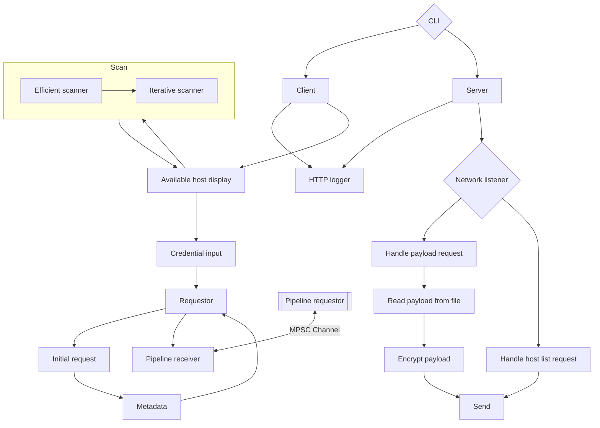

# Redit
Redit is a postmodern file transfer protocol for intranetwork file hosting and
reception.

## Network lifetime
Redit connections are [stateless](https://en.wikipedia.org/wiki/Statelessness).
No data is visibly remembered about any connection across any connects. Peers
communicate by continously searching the network for each other through two
modes: an *efficient* scan and an iterative scan. The efficient scan connects
to known peers of the network, asking them to share their known peers back. The
iterative scan, as self-described, iterates over the network optimistically.
This configuration makes a Redit network a fully unstructured peer-to-peer
network.

After a client has acquired knowledge of a server (both are considered peers),
the protocol permits the client to request any payload from the server. For
practical purposes, the client should begin by requesting the 0th payload of the
media. Beside the data, the payloads contain their index and the total number
of paylods. A full transmission thus requires an iteration over all payloads
based on the number of payloads reported to exist by the first payload. The
data is encrypted.

Servers simply split hosted files into payloads, optionally encrypted, before
opening a connection on the Redit port.

To keep the network saturated, payloads are requested in such a manner that a
number of payloads are requested while not all previously requested are
received. This is called pipelining, but is not the same type of pipelining
as HTTP pipelining.

Below is a visualisation of a typical connection:

## Application overview

## Build
### Nix/NixOS
1. `nix develop`
2. `cargo run --`

### Windows
1. Install the
   [Cargo](https://doc.rust-lang.org/cargo/getting-started/installation.html)
   toolchain separately.
2. Clone [vcpkg](https://github.com/microsoft/vcpkg) at an appropriate location.
3. `.\bootstrap-vcpkg.bat`
4. `.\vcpkg install openssl`
5. `$env:OPENSSL_DIR="C:\...\vcpkg\installed\x64-windows-static\"`
6. Navigate to this repository root.
7. `cargo run --`

